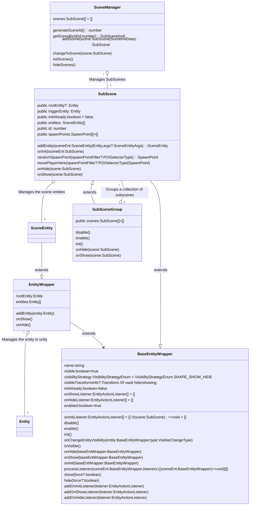

# Lazy Loading

This is an optimized scene that only loads certain entities when the player approaches them. This reduces the scene load time, and also has less of an impact on framerate as the player moves through the scene.


Art galleries often include a lot of NFTs, which raises the material count and impacts performance considerably. Keep in mind that the material count only considers materials being used at a given time. Entities that are not currently being loaded aren't counted. The ideal solution is to not load everything at once, but instead to load and unload content that is indoors as the player enters the corresponding parts of the scene.

This scene includes multiple small buildings, each with a set of NFTs in it. Each of these buildings has a trigger area that loads its NFTs only when the player walks near it, and then hides them when the player walks away.

For easier maintenance, the scene lists all of the NFTs in the scene in an array, including data about their positions and what subScene they belong to. The scene then assigns these to their corresponding subScene and handles showing and hiding them when appropriate.

We then take this further.  What if you wanted multiple galleries but not the space to display them all in your parcel.  Enter SubScenes.   We show you how to register entities to SubScenes, register those SubScenes to a Scene Manager and from there you can convienently swap out which subscenes you want visible and when.  It also provides a visibilityStrategy flag on the SubScene and registered SceneEntities allowing you to further fine tune how you manage resources of the scene.

## Video Tutorial

[https://www.youtube.com/watch?v=DXB72BNdEuU](https://www.youtube.com/watch?v=DXB72BNdEuU)


**Install the CLI**

Download and install the Decentraland CLI by running the following command

```bash
npm i -g decentraland
```

For a more details, follow the steps in the [Installation guide](https://docs.decentraland.org/documentation/installation-guide/).

**Previewing the scene**

Once you've installed the CLI, download this example and navigate to its directory from your terminal or command prompt.

_from the scene directory:_

```
$:  dcl start
```

Any dependencies are installed and then the CLI will open the scene in a new browser tab automatically.

Learn more about how to build your own scenes in our [documentation](https://docs.decentraland.org/) site.


## Hide / Show Options

When you wrap an SDK Entity in a EntityWrapper class and put it into a SubScene when SubScene init(), hide(), show() is called you can choose if that entity is removed from the engine or just hidden with a `visibilityStrategy` flag.

```
sceneEntity.visibilityStrategy = VisibilityStrategyEnum.ENGINE_ADD_REMOVE
OR
sceneEntity.visibilityStrategy = VisibilityStrategyEnum.SHAPE_SHOW_HIDE
```

#### `ENGINE_ADD_REMOVE`

Pros

* Performance gain as it completely removes the item from engine so in no way impacts engine resources (GPU, textures, systems etc)

Cons

* Hiding and particularly showing (for the first time) may cause some increased CPU work and may not appear immeidatly in scene.   You need to account for this.

Could be good or bad

* Systems are no longer aware of the entity and operate on it

#### `SHAPE_SHOW_HIDE`

Pros

* Performance gain for the GPU.  It does not have to spend time on rendering it.
* Because it is already in the engine it has faster loading time when hide/showing  

Cons

* While the GPU does not have to render it, it is still in the engine consuming resources. For example Systems still see it and operate on it.  Textures, Body counts remain higher

Could be good or bad

* Systems are still aware of the entity and operate on it


### Listeners

You also can choose to implement listeners to react to hiding and showing of the entity.   From here you can fully customize the life cycle of the object from a init, show and hide perspective.  For example could choose to lazy load the entity when the scene itself is init.

```
sceneEnt.addOnInitListener((entityWrap)=>{
  //do something special
})
sceneEnt.addOnShowListener((entityWrap)=>{
  //do something special
}) 
sceneEnt.addOnHideListener((entityWrap)=>{
  //do something special
})
```


## Usage of Scene Manager

see `/src/subSceneSetup.ts` for an exampe of how to use Scene Manager with SubScenes

```
SCENE_MGR = new SceneManager(); 

//make scene1
const mySceneEntity = new Entity()
mySceneEntity.addComponent(new BoxShape())

const sceneId = SCENE_MGR.generateSceneId()
const subScene = new SubScene(sceneId,"myScene",[],undefined,undefined)

const sceneEntity = subScene.addEntity(mySceneEntity) 
sceneEntity.visibilityStrategy = VisibilityStrategyEnum.ENGINE_ADD_REMOVE

SCENE_MGR.addScene(subScene)

//make scene2
const mySceneEntity2 = new Entity()
mySceneEntity2.addComponent(new ConeShape())

const sceneId2 = SCENE_MGR.generateSceneId()
const subScene2 = new SubScene(sceneId2,"myScene2",[],undefined,undefined)

const sceneEntity2 = subScene2.addEntity(mySceneEntity2) 
sceneEntity2.visibilityStrategy = VisibilityStrategyEnum.ENGINE_ADD_REMOVE

SCENE_MGR.addScene(subScene2)


...

SCENE_MGR.changeToScene(subScene) //change to desired scene

```

## Class Diagram




## Copyright info

This scene is protected with a standard Apache 2 licence. See the terms and conditions in the [LICENSE](/LICENSE) file.
