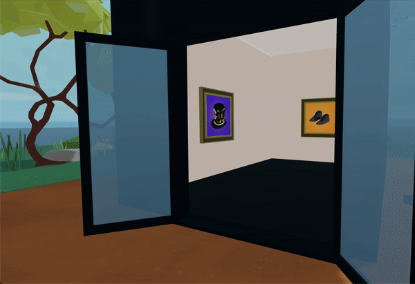

# Lazy Loading

This is an optimized scene that only loads certain entities when the player approaches them. This reduces the scene load time, and also has less of an impact on framerate as the player moves through the scene.



Art galleries often include a lot of NFTs, which raises the material count and impacts performance considerably. Keep in mind that the material count only considers materials being used at a given time. Entities that are not currently being loaded aren't counted. The ideal solution is to not load everything at once, but instead to load and unload content that is indoors as the player enters the corresponding parts of the scene.

This scene includes multiple small buildings, each with a set of NFTs in it. Each of these buildings has a trigger area that loads its NFTs only when the player walks near it, and then hides them when the player walks away.

For easier maintenance, the scene lists all of the NFTs in the scene in an array, including data about their positions and what subScene they belong to. The scene then assigns these to their corresponding subScene and handles showing and hiding them when appropriate.

**Install the CLI**

Download and install the Decentraland CLI by running the following command

```bash
npm i -g decentraland
```

For a more details, follow the steps in the [Installation guide](https://docs.decentraland.org/documentation/installation-guide/).

**Previewing the scene**

Once you've installed the CLI, download this example and navigate to its directory from your terminal or command prompt.

_from the scene directory:_

```
$:  dcl start
```

Any dependencies are installed and then the CLI will open the scene in a new browser tab automatically.

Learn more about how to build your own scenes in our [documentation](https://docs.decentraland.org/) site.

## Class Diagram


## Copyright info

This scene is protected with a standard Apache 2 licence. See the terms and conditions in the [LICENSE](/LICENSE) file.
